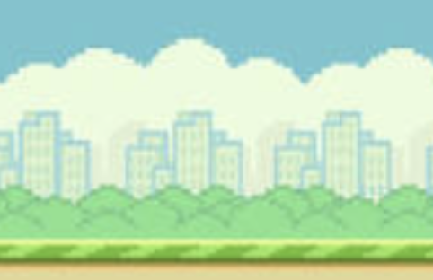

# Iriebird

## About
A flappy-bird mock game with a carribean touch. Guide a bird through a series of moving green pipes by tapping the screen to make it flap its wings.

## features
1. Access on mobile or desktop devices (touch)
2. control bird with a mouseclick, tap, or any key
3. Scoring included

## Languages:
1. JavaScript
2. CSS
3. HTML  